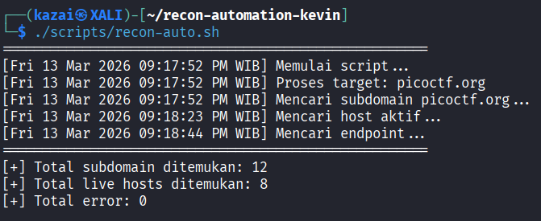
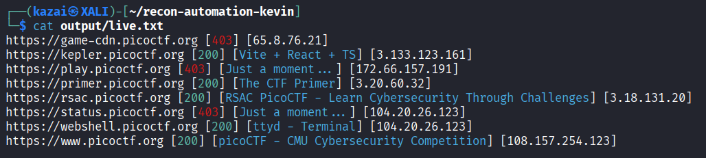
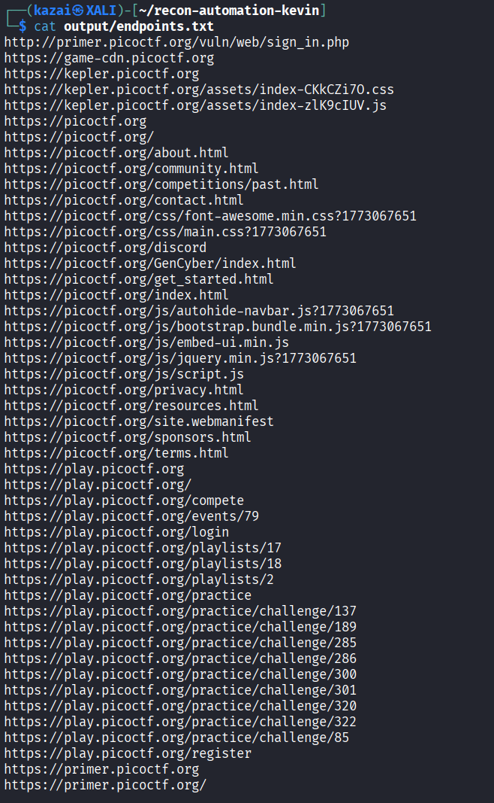

# Recon Automation Script

Recon Automation Script adalah script Bash sederhana yang digunakan untuk mengotomatisasi proses **reconnaissance awal dalam web security testing**. Script ini membantu melakukan beberapa tahap penting dalam proses recon secara otomatis, mulai dari enumerasi subdomain, mendeteksi host yang aktif, hingga melakukan crawling endpoint dari target.

Pipeline yang digunakan dalam script ini:

domain → subdomain enumeration → live host detection → endpoint discovery

Script ini juga dilengkapi dengan **logging, error handling, dan deduplikasi hasil**, sehingga proses recon dapat berjalan lebih stabil dan terstruktur.

---

## Tools yang Digunakan

Script ini memanfaatkan beberapa tools populer dalam ekosistem **web reconnaissance dan offensive security**.

### subfinder

Digunakan untuk melakukan **subdomain enumeration secara pasif** dari berbagai sumber OSINT.

Contoh output:

```
sub.example.com
api.example.com
dev.example.com
```

---

### anew

Digunakan untuk melakukan **deduplikasi data secara realtime**.
Jika data yang sama muncul kembali, `anew` tidak akan menambahkannya ke file output.

Contoh penggunaan:

```
subfinder | anew all-subdomains.txt
```

---

### httpx

Digunakan untuk **mendeteksi host yang aktif** dari daftar subdomain.

Tool ini juga memberikan informasi tambahan seperti:

* HTTP status code
* Page title
* IP address

Contoh output:

```
https://example.com [200] [Example Domain] [93.184.216.34]
```

---

### katana

Digunakan untuk melakukan **crawling endpoint dari host yang aktif**.

Tool ini dapat menemukan berbagai path seperti:

```
/login
/admin
/api
/dashboard
```

---

## Workflow Recon Script

Script bekerja dengan pipeline berikut:

```
domains.txt
     │
     ▼
 subfinder
     │
     ▼
anew (deduplicate)
     │
     ▼
all-subdomains.txt
     │
     ▼
   httpx
     │
     ▼
  live.txt
     │
     ▼
   katana
     │
     ▼
endpoints.txt
```

Penjelasan alur kerja:

1. Script membaca daftar domain dari `input/domains.txt`
2. `subfinder` mencari seluruh subdomain dari domain target
3. `anew` memastikan tidak ada subdomain yang duplikat
4. `httpx` mengecek subdomain mana yang aktif
5. `katana` melakukan crawling endpoint dari host yang aktif
6. Script menampilkan ringkasan hasil di akhir eksekusi

---

## Struktur Repository

```
recon-automation-kevin
│
├── input
│   └── domains.txt
│
├── logs
│   ├── progress.log
│   └── errors.log
│
├── output
│   ├── all-subdomains.txt
│   ├── live.txt
│   └── endpoints.txt
│
├── screenshots
│   ├── run-script.png
│   ├── live-hosts.png
│   └── endpoints.png
│
├── scripts
│   └── recon-auto.sh
│
└── README.md
```

---

## Setup Environment

Clone repository ini ke mesin lokal:

```
git clone https://github.com/kevinalfathan/recon-automation-kevin.git
```

Masuk ke direktori project:

```
cd recon-automation-kevin
```

## Install Tools

Pastikan **Go** sudah terinstall karena beberapa tools menggunakan Go dan folder Go binary ada di PATH:

```
export PATH=$PATH:~/go/bin
```
### Install subfinder

```
go install -v github.com/projectdiscovery/subfinder/v2/cmd/subfinder@latest
```

### Install httpx

```
go install -v github.com/projectdiscovery/httpx/cmd/httpx@latest
```

### Install katana

```
go install github.com/projectdiscovery/katana/cmd/katana@latest
```

### Install anew

```
go install github.com/tomnomnom/anew@latest
```


---

## Cara Menjalankan Script

Pastikan repository sudah di-clone dan semua tools telah terinstall.

Berikan permission eksekusi pada script:

```
chmod +x scripts/recon-auto.sh
```

Jalankan script:

```
./scripts/recon-auto.sh
```

Script akan otomatis:

* membaca domain dari file input
* melakukan subdomain enumeration
* mendeteksi host yang aktif
* melakukan crawling endpoint
* menyimpan hasil ke folder output

---

## Contoh Input

File `input/domains.txt`

```
picoctf.org
```

Script juga dapat menerima beberapa domain sekaligus:

```
hackerone.com
hackthebox.com
tryhackme.com
```

---

## Contoh Output

### Live Hosts

File: `output/live.txt`

```
https://game-cdn.picoctf.org [403] [65.8.76.79]
https://kepler.picoctf.org [200] [Vite + React + TS] [3.133.123.161]
https://play.picoctf.org [403] [Just a moment...] [172.66.157.191]
https://primer.picoctf.org [200] [The CTF Primer] [3.20.60.32]
https://rsac.picoctf.org [200] [RSAC PicoCTF - Learn Cybersecurity Through Challenges] [3.18.131.20]
https://status.picoctf.org [403] [Just a moment...] [104.20.26.123]
https://webshell.picoctf.org [200] [ttyd - Terminal] [172.66.157.191]
https://www.picoctf.org [200] [picoCTF - CMU Cybersecurity Competition] [108.157.254.23]
```

---

### Crawled Endpoints

File: `output/endpoints.txt`

```
https://www.picoctf.org
https://www.picoctf.org/
https://www.picoctf.org/about.html
https://www.picoctf.org/competitions/2026-spring.html
https://www.picoctf.org/competitions/2026-spring-rules.html
https://www.picoctf.org/css/bs-stepper.min.css
https://www.picoctf.org/css/font-awesome.min.css
https://www.picoctf.org/css/main.css
https://www.picoctf.org/get_started.html
```

---

## Penjelasan Script

Berikut penjelasan bagian utama dari script `recon-auto.sh`.

---

### 1. Error Handling dan Base Directory

```
set -Eeuo pipefail

BASE_DIR="$(cd "$(dirname "${BASH_SOURCE[0]}")/.." && pwd)"
```

Bagian ini meningkatkan stabilitas script.

`set -Eeuo pipefail` memastikan script akan berhenti jika terjadi error agar proses tidak berjalan dalam kondisi tidak valid.

`BASE_DIR` digunakan untuk menentukan direktori utama repository sehingga script tetap dapat dijalankan dari lokasi manapun.

---

### 2. Variabel Direktori

```
INPUT="$BASE_DIR/input"
OUTPUT="$BASE_DIR/output"
LOGS="$BASE_DIR/logs"

mkdir -p "$INPUT" "$OUTPUT" "$LOGS"
```

Bagian ini mendefinisikan direktori utama yang digunakan oleh script.

Jika direktori belum ada, maka `mkdir -p` akan membuatnya secara otomatis.

---

### 3. Error Logging

```
exec 2>> "$LOGS/errors.log"
```

Semua pesan error (`stderr`) dari tools akan otomatis disimpan ke file:

```
logs/errors.log
```

Hal ini memudahkan proses debugging tanpa mengganggu output utama di terminal.

---

### 4. Subdomain Enumeration

```
subfinder -d "$domain" -silent | anew "$OUTPUT/all-subdomains.txt"
```

Script menggunakan `subfinder` untuk mencari subdomain dari domain target.

Output kemudian diproses oleh `anew` untuk memastikan hanya **subdomain unik** yang disimpan.

---

### 5. Live Host Detection

```
httpx -l "$OUTPUT/all-subdomains.txt" -silent -status-code -title -ip
```

`httpx` digunakan untuk memeriksa apakah subdomain dapat diakses.

Tool ini juga menampilkan informasi tambahan seperti:

* HTTP status code
* Page title
* IP address

Hasilnya disimpan di:

```
output/live.txt
```

---

### 6. Endpoint Crawling

```
katana -silent -depth 3
```

`katana` melakukan crawling pada host yang aktif untuk menemukan endpoint baru.

Contohnya:

```
/login
/admin
/api
```

Semua endpoint yang ditemukan akan disimpan di:

```
output/endpoints.txt
```

---

### 7. Statistik Hasil

```
total_sub=$(wc -l < "$OUTPUT/all-subdomains.txt")
total_live=$(wc -l < "$OUTPUT/live.txt")
total_errors=$(wc -l < "$LOGS/errors.log")
```

Di akhir eksekusi script akan menampilkan ringkasan hasil:

* jumlah subdomain unik
* jumlah host aktif
* jumlah error yang terjadi

---

## Screenshots

### Menjalankan Script



### Live Hosts



### Endpoints




